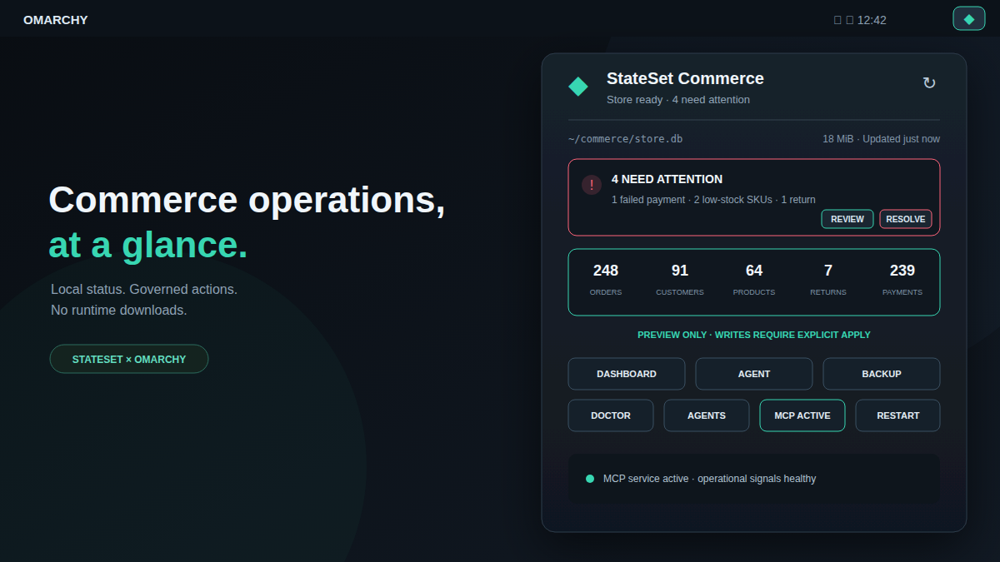

# StateSet iCommerce for Omarchy

The native Omarchy surface for
[StateSet iCommerce](https://github.com/stateset/stateset-icommerce). It adds a
commerce health widget and operator panel backed by a local, read-only status
service.



## Install with Omarchy

Install the version-matched controller explicitly, then add the plugin from its
public repository:

```bash
npm install --global @stateset/cli@1.30.0
omarchy plugin add https://github.com/stateset/stateset-omarchy-plugin.git --enable
```

The plugin contains no install hooks and does not request elevated privileges.
Omarchy clones and validates the QML before enabling it. Routine plugin use
never downloads or executes code: install the StateSet controller separately
before enabling the shell surface.

To configure a store, run this from its project directory:

```bash
stateset-omarchy install --db ./store.db
```

The configurator recognizes the Git-managed plugin and leaves its checkout
intact, so `omarchy plugin update com.stateset.icommerce` remains the owner of
shell upgrades.

Requirements are Omarchy Quattro with shell plugin support and a separately
installed StateSet CLI on Node.js 20.20 or newer. If the controller is missing,
the widget fails closed and displays a bounded installation error.

Upgrade atomically with `--force`. If the updated plugin cannot be enabled, the
installer restores the previous plugin. Remove the shell integration with
`stateset-omarchy uninstall`; store data, StateSet configuration, and agent
configuration are retained.

The installer adds the widget, Commerce entries in the Omarchy menu, and local
MCP configuration for Claude, Codex, and OpenCode. The widget surfaces failed
payments, low stock, pending returns, and pending orders, with optional desktop
notifications when exceptional conditions (failed payments, low stock, or
pending returns) increase. Routine pending-order growth remains visible without
creating notification noise. MCP writes remain in preview mode. See the main
iCommerce documentation for governed apply mode.

## Using the widget

Left-click the bar icon to open the operations panel. Right- or middle-click it
to refresh immediately; with the panel open, press `R` to do the same. Use the
arrow keys or `H`/`J`/`K`/`L` to move through actions and `Enter` or `Space` to
activate one. Direct shortcuts are `D` for Dashboard, `A` for Agent, `B` for
Backup, `C` for Doctor, `G` for agent configuration, and `M` for the MCP
service toggle. The panel
shows all five store totals, database size, current attention items, operating
mode, data freshness, and the last known snapshot if a refresh temporarily fails.
If an individual orders, payments, returns, or inventory query fails while the
store remains reachable, the panel identifies the missing signals instead of
presenting partial results as fully healthy.

`Dashboard`, `Agent`, and `Backup` are available after the store is configured.
`Review` opens the sanitized attention report, while `Resolve` starts the
matching preview-only specialist. If status is unavailable, `Doctor` diagnoses
the controller and desktop integration from a floating terminal. The secondary
actions can reconfigure all supported agents or explicitly install and start
the loopback MCP service.

The bar-widget settings control polling (30–1,800 seconds), desktop
notifications, a 1–240 minute notification cooldown, and which exceptional
signals may notify. Notifications honor Omarchy's Do Not Disturb state, never
fire on the first snapshot, and do not alert for routine pending-order growth.
Suppressed increases are coalesced in XDG state, reconciled against the next
healthy snapshot, and delivered when Do Not Disturb and the cooldown permit.
Interactive controls expose accessible roles, names, descriptions, and press
actions in addition to full keyboard navigation.
The IPC surface is also scriptable:

```bash
omarchy-shell com.stateset.icommerce refresh
omarchy-shell com.stateset.icommerce status
omarchy-shell com.stateset.icommerce toggle
```

`status` returns JSON with readiness, configuration, refresh and stale-state
flags, controller schema and failure classifications, timestamps, store size,
counts, alerts, operational-signal health, adaptive-retry timing, and whether
the MCP lifecycle state is current. It also exposes pending notification counts
and the latest native MCP action result. Failed status polling backs off from the
configured interval to a maximum of 30 minutes; a successful refresh returns
normal scheduling, and manual refresh remains available throughout.

The QML plugin runs only `stateset-omarchy status --json` and explicit commands
selected by the operator. It does not read credentials, edit the commerce
database, or accept model-supplied shell commands.

The optional loopback MCP service supports explicit `status`, `start`, `stop`,
`restart`, and `remove` lifecycle actions through `stateset-omarchy service`.
Install, start, stop, and restart run as bounded direct processes and report
their result in the panel; a fixed timeout prevents a vanished controller from
stranding an action, and stop and restart require a second confirmation.
The panel can also open the latest 100 lines from the fixed user-service journal
in a visible terminal, even while controller recovery is in progress; it does
not stream logs into the shell process.
Use `stateset-omarchy attention` for a sanitized, provider-free operations
report, `stateset-omarchy remediate` to open the matching preview-only
specialist, and `stateset-omarchy doctor` to verify a target desktop installation.
Shell and menu actions require the locally installed controller and never fetch
packages at runtime.

## Troubleshooting

Run `stateset-omarchy doctor` first. If the controller is missing or the plugin
and controller versions differ, reinstall the version shown in
`manifest.json`, then restart the shell:

```bash
npm install --global @stateset/cli@1.30.0
omarchy restart shell
```

The plugin deliberately keeps the last successful snapshot visible during a
transient controller error, marks it as stale, and never treats stale data as a
healthy store.

## Remove

Remove a native Git installation through Omarchy, then clean up the optional
StateSet menu and user service:

```bash
omarchy plugin remove com.stateset.icommerce
stateset-omarchy uninstall --no-disable
```

Store data, StateSet configuration, and project agent configuration are
retained.

## Security

Commerce writes remain preview-only unless an operator explicitly configures
governed apply mode with kernel policy, principal, and store identity files.
The plugin never receives those identities as model arguments. Review
[the trust model](https://github.com/stateset/stateset-icommerce/blob/master/TRUST_FOUNDATION.md)
before enabling mutations.

## Development

The source of truth is
[`cli/omarchy`](https://github.com/stateset/stateset-icommerce/tree/master/cli/omarchy).
Release automation opens synchronization PRs in this standalone repository so
that plugin updates remain reviewable. Validate a checkout with:

```bash
node --test
omarchy plugin validate .
git diff --check
```

Pure status parsing, sanitization, bounds, durable notification policy, compact
metrics, freshness labels, and service lookup are covered by the local test
suite. Qt runtime tests instantiate the service and exercise DND delivery and
native MCP actions. The CI workflow also validates every change against a
pinned Omarchy revision and parses/static-checks both QML entry points with a
zero-warning budget for every diagnostic independent of external Quickshell
type metadata. Runtime
QML is generated from the upstream directory; repository-only tests, preview
assets, handoff material, and workflows are preserved across release
synchronization. See [ARCHITECTURE.md](ARCHITECTURE.md) for the runtime trust
boundaries and [UPSTREAM.md](UPSTREAM.md) for the upstream handoff workflow.

### Deterministic demo

Validate every fictional controller fixture without touching the desktop:

```bash
./demo/run --check
```

On an Omarchy desktop, launch the current checkout against isolated fictional
data with `./demo/run attention`. Other states include `healthy`, `empty`,
`partial`, `governed`, `unavailable`, `controller-missing`, `timeout`, and
`oversized`. Capture the real bar and panel with:

```bash
./demo/run attention --screenshot --output ~/Pictures/stateset-demo.png
```

The harness backs up the installed plugin and shell configuration, uses a
temporary XDG state directory, intercepts every StateSet command, and restores
the original session on exit.
